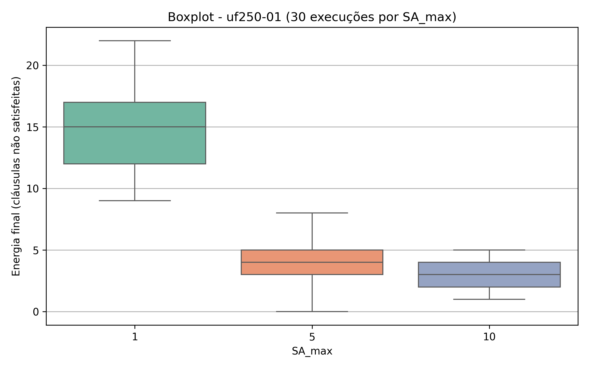

# 🧩 Simulated Annealing for 3-SAT

This repository contains an implementation of the **Simulated Annealing (SA)** algorithm applied to the **3-SAT** problem. The goal is to minimize the number of unsatisfied clauses by exploring the space of Boolean variable assignments using a probabilistic search strategy.

We tested multiple configurations of the `SA_max` parameter (1, 5, and 10) across CNF instances with 20, 100, and 250 variables, evaluating how different settings influence convergence and final solution quality.

---

## ⚙️ Installation

Make sure you have Python 3 installed, then run:

```bash
pip install matplotlib seaborn pandas joblib
```

---

## 🚀 Running the Code (macOS / Unix-like)

To execute the experiments and generate the results:

```bash
python3 simulated_annealing.py
```

This will run 30 executions for each configuration and generate boxplots in the `graficos/` folder.

---

## 🧠 How It Works

### 🔄 Simulated Annealing Algorithm

- **Initialization:** Random Boolean assignments are generated.
- **Energy Function:** The number of unsatisfied clauses is computed for each assignment.
- **Neighbor Generation:** A new solution is generated by flipping a single Boolean variable.
- **Acceptance Criteria:** Solutions with lower energy are accepted; worse solutions may also be accepted with a probability  
  **P = exp(-ΔE / T)** to escape local minima.
- **Cooling Schedule:** The temperature is multiplied by a decay factor (`cooling_rate = 0.99`) until it reaches a minimum.

### 🔧 Parameter `SA_max`

The `SA_max` parameter defines how many iterations are performed at each temperature level. It controls the depth of local search per step.

- `SA_max = 1`: Shallow search per temperature (more stochastic)
- `SA_max = 10`: Deeper local search (greedier behavior)

### 📈 Graph Generation

For each instance and configuration, a boxplot is generated to illustrate:

- Distribution of energy (number of unsatisfied clauses)
- Comparison between different `SA_max` values across problem sizes

---

## 🖼️ Results

Below are example boxplots generated by the code:

### Instance: 20 variables


### Instance: 100 variables


### Instance: 250 variables


---

## 📁 Project Structure

```
.
├── uf20-01.cnf
├── uf100-01.cnf
├── uf250-01.cnf
├── simulated_annealing.py
├── graficos/
│   ├── boxplot_uf20-01.png
│   ├── boxplot_uf100-01.png
│   └── boxplot_uf250-01.png
└── README.md
```

---

Bachelor of Computer Science  
Focused on Optimization, Heuristics, and Artificial Intelligence
